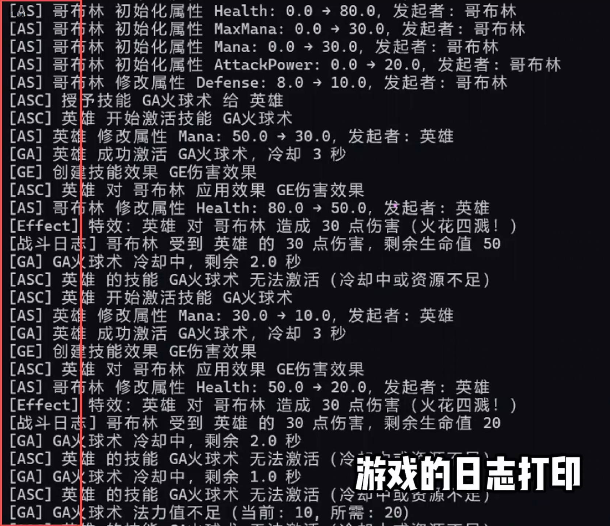

本项目用 C# 模仿 UE5 虚幻官方 GAS 关键类和流程。

## 核心类职责说明

### 1. `Character` 类

- **角色基类**：代表游戏中持有技能系统的实体（如玩家、NPC）
- **核心职责**：
  - 持有技能系统核心组件 `AbilitySystemComponent`
  - 存储实体名称等基础信息
- **关键属性**：
  - `ASC`：技能系统组件，负责技能的管理与执行
  - `Name`：实体名称

### 2. `Target` 类

- **目标实体类**：代表技能作用的目标（如被攻击的敌人）
- **核心职责**：
  - 存储目标基础信息（如名称）
  - 作为技能效果的作用对象

### 3. `AbilitySystemComponent`（ASC）

- **技能系统核心组件**：类比 UE 中的 UAbilitySystemComponent
- **核心职责**：
  - 管理技能的授权（Grant）与存储
  - 处理技能激活请求（TryActivateAbility）
  - 应用技能效果（ApplyGameplayEffectToSelf）
- **关键方法**：
  - `GrantAbility`：向实体授予技能
  - `TryActivateAbility`：尝试激活指定技能
  - `ApplyGameplayEffectToSelf`：应用技能效果

### 4. `GameplayAbility` 类

- **技能基类**：定义技能的通用行为
- **核心职责**：
  - 管理技能冷却（Cooldown）
  - 提供技能激活检查（CanActivate）
  - 定义技能执行入口（Activate）
- **关键属性**：
  - `Name`：技能名称
  - `CooldownSeconds`：冷却时间（秒）
- **关键方法**：
  - `CanActivate`：检查技能是否可激活（冷却是否结束）
  - `Activate`：激活技能（执行冷却检查并调用具体执行逻辑）
  - `ExecuteAbility`：抽象方法，由子类实现具体技能逻辑

### 5. `GameAbility_Fireball` 类

- **具体技能实现**：火球术技能，继承自 `GameplayAbility`
- **核心职责**：
  - 实现火球术的具体执行逻辑
  - 定义火球术的名称和冷却时间（3秒）
- **实现细节**：激活时创建伤害效果并通过 ASC 应用

### 6. `GameplayEffect` 类

- **技能效果基类**：定义技能产生的效果（如伤害、治疗、Buff等）
- **核心职责**：
  - 提供效果应用的抽象接口（Apply）
- **关键方法**：
  - `Apply`：抽象方法，由子类实现具体效果逻辑

### 7. `GameplayEffect_Damage` 类

- **具体效果实现**：伤害效果，继承自 `GameplayEffect`
- **核心职责**：
  - 实现伤害效果的应用逻辑
  - 存储伤害数值信息

### 8. `AbilityContext` 类

- **技能上下文类**：传递技能执行过程中的关键信息
- **核心职责**：
  - 存储技能来源（Source）、目标（Target）
  - 传递技能参数（如基础伤害值）

### 9. `EffectHandler` 类

- **效果处理器**：处理效果的实际表现逻辑
- **核心职责**：
  - 执行效果的具体表现（如打印伤害日志）
  - 通过事件（OnDamage）通知其他系统（如UI、音效系统）
- **关键机制**：使用委托事件实现低耦合的通知机制

## 执行流程示例（以火球术为例）

1. **初始化**：

   - 创建 `EffectHandler` 实例处理效果表现
   - 创建 `Actor`（英雄）和 `Target`（怪物）实例
   - 向英雄的 ASC 授予火球术技能

2. **技能激活**：

   - 调用 `ASC.TryActivateAbility("Fireball", context)` 发起激活请求
   - ASC 检查技能是否存在，调用技能的 `Activate` 方法
   - 技能检查冷却时间，若可激活则记录使用时间并执行 `ExecuteAbility`

3. **效果应用**：

   - 火球术创建 `GameplayEffect_Damage` 实例
   - 通过 ASC 调用 `ApplyGameplayEffectToSelf` 应用效果
   - 伤害效果调用 `EffectHandler` 执行实际伤害逻辑
   - `EffectHandler` 触发 `OnDamage` 事件，输出伤害日志

   
